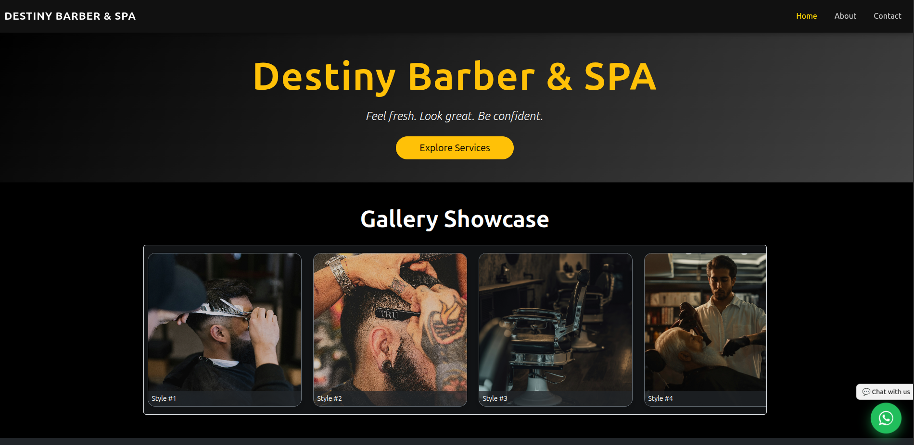
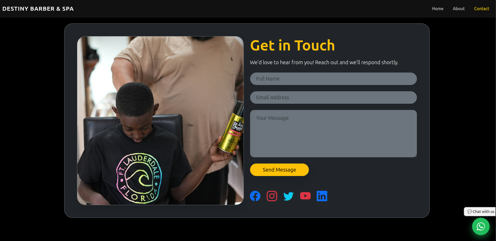

# Destiny Barbershop & SPA

A modern, full-featured hybrid digital solution designed to showcase and manage services offered by a barbershop and spa. This project combines elegant UI design, seamless navigation, and smart integrations such as WhatsApp contact and Google Maps, tailored for both desktop and mobile environments.

---

## Table of Contents

- [Project Overview](#project-overview)
- [Features](#features)
- [Tech Stack](#tech-stack)
- [Installation](#installation)
- [Project Structure](#project-structure)
- [Usage](#usage)
- [Deployment](#deployment)
- [Screenshots](#screenshots)
- [Contact](#contact)
- [License](#license)

---

## Project Overview

Destiny Barbershop & SPA is a responsive hybrid web application that allows users to:

- Explore services with visual thumbnails and pop-up modals for detailed descriptions.
- Book appointments (coming soon with backend/API integration).
- Navigate easily between Home, About, Services, and Contact pages.
- Connect via WhatsApp or locate the business using an embedded Google Map.

The project is built using **ReactJS** and designed with future hybrid/mobile adaptability in mind using tools like Capacitor or Expo.

---

## Features

### User Interface

- Modern dark theme for a sleek and professional appearance
- Responsive layout that adapts to mobile and desktop
- Animated scroll effects (AOS) for engaging UX

### Services

- Image cards for each service (Beard Trim, Facial, Massage, Hair Coloring, Nail Care, Kids Haircut, Waxing)
- "Learn More" buttons open modals with descriptions and pricing

### Contact & Location

- Embedded Google Map for directions
- WhatsApp link for instant messaging

### About Page

- Display team members with names, roles, and images

---

## Tech Stack

| Category         | Technologies                         |
| ---------------- | ------------------------------------ |
| Frontend         | ReactJS, React Router DOM            |
| Styling          | CSS, Bootstrap, AOS, TailwindCSS     |
| Optional Backend | Node.js / Express or Python Flask    |
| Deployment       | Vercel, Netlify, Firebase (optional) |
| Hybrid Ready     | Capacitor / Expo (React Native)      |

---

## Installation

### Prerequisites

- Node.js (v18 or higher)
- npm or yarn

### 1. Clone the Repository

```bash
git clone https://github.com/your-username/destiny-barbershop-spa.git
cd destiny-barbershop-spa
```

### 2. Install Dependencies

```bash
npm install
# or
yarn install
```

### 3. Start the Development Server

```bash
npm run dev
# or
yarn dev
```

The app will run at `http://localhost:5173/` (or as specified in your config).

---

## Project Structure

```
├── public/
│   └── index.html
├── src/
│   ├── assets/                # Images
│   ├── components/            # Reusable Components
│   │   ├── Home.jsx
│   │   ├── ServicesSection.jsx
│   │   ├── AboutSection.jsx
│   │   ├── ContactSection.jsx
│   │   └── ServiceModal.jsx
│   ├── App.jsx                # Main App Layout
│   ├── main.jsx               # React DOM Root
│   └── index.css              # Global Styling
├── package.json
└── README.md
```

---

## Usage

- Navigate to **Home** to see hero section and a welcome message.
- Visit **About Us** to meet the barbers and SPA team.
- Open **Contact** to view the Google Map and use the WhatsApp chat link.

---

## Deployment

This project can be deployed easily on platforms like:

- [Vercel](https://vercel.com)
- [Netlify](https://netlify.com)
- Firebase Hosting

### Steps to Deploy on Vercel:

1. Push your code to GitHub.
2. Go to [vercel.com](https://vercel.com) and import your GitHub repository.
3. Follow the setup wizard and deploy!

---

## Screenshots

### Home Page



### Service Details Modal


### Contact Section



---

## Contact

For questions, contributions, or business inquiries:

- Email: [info@destinybarberspa.co.ke](mailto:info@destinybarberspa.co.ke)
- Phone: +254 712 345 678
- Website: [www.destinybarberspa.co.ke](http://www.destinybarberspa.co.ke)
- WhatsApp: [Click to Chat](https://wa.me/254711371896)

---

## License

MIT License. See [LICENSE](./LICENSE) for more details.

---

**Crafted with ❤️ by Shadrack Kiplagat**
